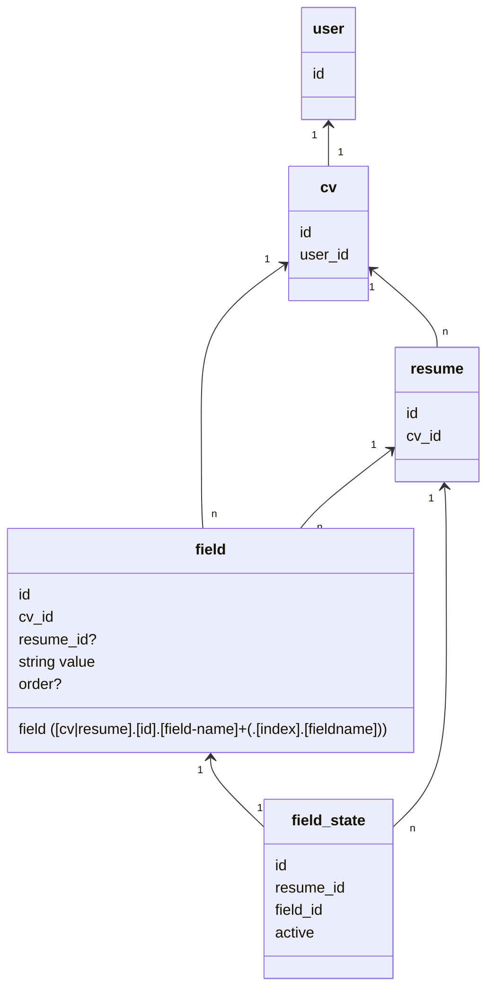

# Resume Factory Database Model

```mermaid
classDiagram
    user "1" <-- "1" cv
    cv "1" <-- "n" resume
    cv "1" <-- "n" field
    resume "1" <-- "n" field
    field "1" <-- "1" field_state
    resume "1" <-- "n" field_state

    class user {
        id
    }

    class cv {
        id
        user_id
    }

    class resume {
        id
        cv_id
    }

    class field {
        id
        cv_id
        resume_id?
        field ([cv|resume].[id].[field-name]+(.[index].[fieldname]))
        string value
        order?
    }

    class field_state {
        id
        resume_id
        field_id
        active
    }
```
