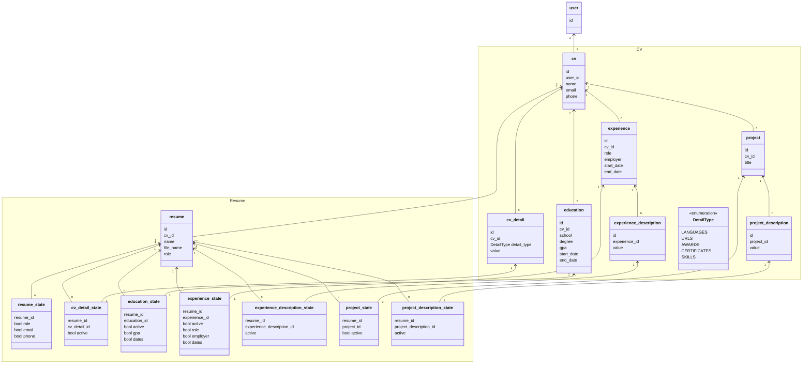
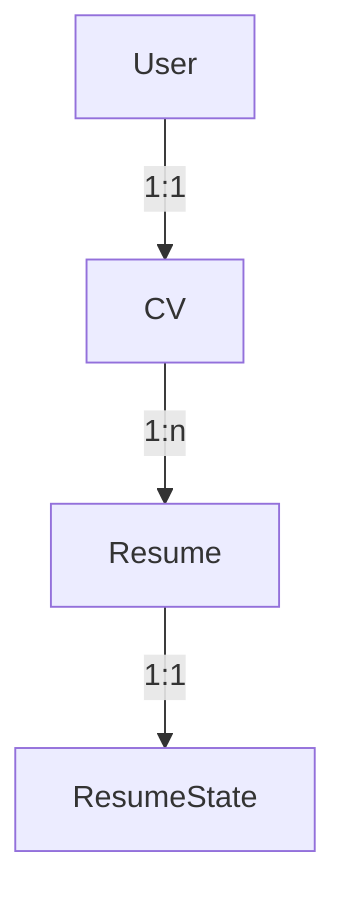

# Resume Factory Database Model

```mermaid
classDiagram
    user "1" <-- "1" cv

    class user {
        id
    }

    cv "1" <-- "n" cv_detail
    cv "1" <-- "n" education
    cv "1" <-- "n" experience
    experience "1" <-- "n" experience_description
    cv "1" <-- "n" project
    project "1" <-- "n" project_description

    cv "1" <-- "n" resume
    resume "1" <-- "n" resume_state
    resume "1" <-- "n" cv_detail_state
    resume "1" <-- "n" education_state
    resume "1" <-- "n" experience_state
    resume "1" <-- "n" experience_description_state
    resume "1" <-- "n" project_state
    resume "1" <-- "n" project_description_state
    cv_detail "1" <-- "1" cv_detail_state
    education "1" <-- "1" education_state
    experience "1" <-- "1" experience_state
    experience_description "1" <-- "1" experience_description_state
    project "1" <-- "1" project_state
    project_description "1" <-- "1" project_description_state

    namespace CV {
        class cv {
            id
            user_id
            name
            email
            phone
        }

        class cv_detail {
            id
            cv_id
            DetailType detail_type
            value
        }
        class DetailType {
            <<enumeration>>
            LANGUAGES
            URLS
            AWARDS
            CERTIFICATES
            SKILLS
        }

        class education {
            id
            cv_id
            school
            degree
            gpa
            start_date
            end_date
        }

        class experience {
            id
            cv_id
            role
            employer
            start_date
            end_date
        }
        class experience_description {
            id
            experience_id
            value
        }

        class project {
            id
            cv_id
            title
        }
        class project_description {
            id
            project_id
            value
        }
    }


    namespace Resume {
        class resume {
            id
            cv_id
            name
            file_name
            role
        }

        class resume_state {
            resume_id
            bool role
            bool email
            bool phone
        }
        class cv_detail_state {
            resume_id
            cv_detail_id
            bool active
        }

        class education_state {
            resume_id
            education_id
            bool active
            bool gpa
            bool dates
        }

        class experience_state {
            resume_id
            experience_id
            bool active
            %% At least one of 'role' and 'employer' must be active
            bool role
            bool employer
            bool dates
        }
        class experience_description_state {
            resume_id
            experience_description_id
            active
        }

        class project_state {
            resume_id
            project_id
            bool active
        }
        class project_description_state {
            resume_id
            project_description_id
            active
        }
    }


```

---

```mermaid
graph TD;
    A[User] -->|1:1| B[CV];
    B -->|1:n| C[Resume];
    C -->|1:1| D[ResumeState];
```
